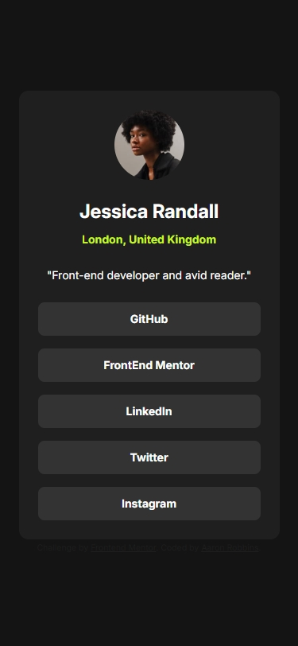
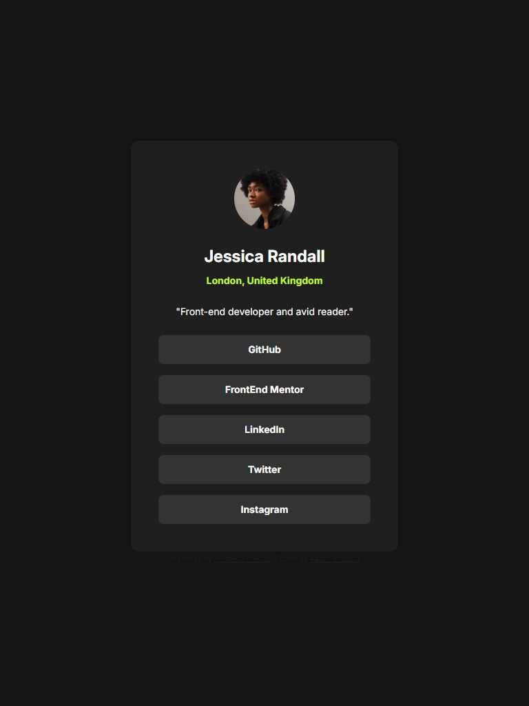
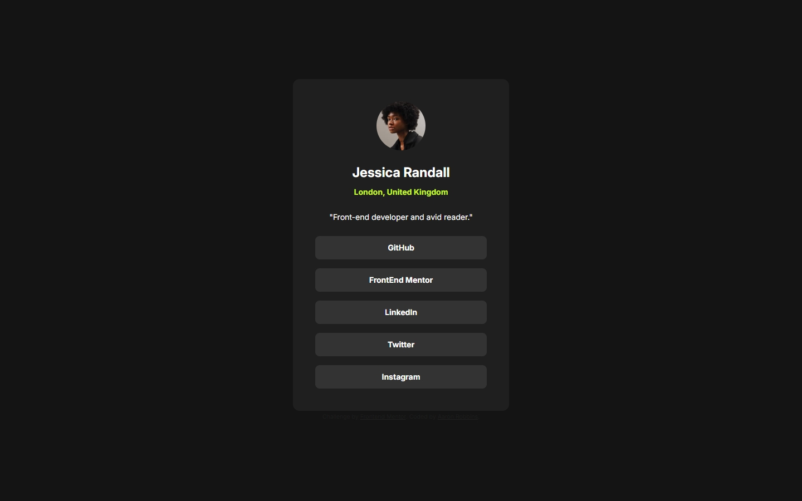

# Frontend Mentor - Social links profile solution

This is a solution to the [Social links profile challenge on Frontend Mentor](https://www.frontendmentor.io/challenges/social-links-profile-UG32l9m6dQ). Frontend Mentor challenges help you improve your coding skills by building realistic projects.

## Table of contents

- [Overview](#overview)
  - [The challenge](#the-challenge)
  - [Screenshot](#screenshot)
  - [Links](#links)
- [My process](#my-process)
  - [Built with](#built-with)
  - [What I learned](#what-i-learned)
  - [Continued development](#continued-development)
  - [Useful resources](#useful-resources)
- [Author](#author)
- [Acknowledgments](#acknowledgments)

## Overview

### The challenge

Users should be able to:

- See hover and focus states for all interactive elements on the page

### Screenshot





### Links

- Solution URL: [Add solution URL here]()
- Live Site URL: [Add live site URL here](https://freexm1nd.github.io/social-links-profile-solution/)

## My process

### Built with

- Semantic HTML5 markup
- CSS custom properties
- Flexbox
- CSS Grid
- Mobile-first workflow

### What I learned

With this project, I decided to dive into CSS custom properties. I used the Figma files to my advantage, creating a naming scheme and custom properties that reflected all of the colors, font weights, and spacing used in the design. It was a good refresher from the lessons I had learned through freeCodeCamp.

Below is some code that reflects the things I learned above:

```html
<nav class="social-profile-links" aria-label="Social media links">
  <a class="social-profile-link" href="https://github.com/" target="_blank"
    >GitHub</a
  >
  <a
    class="social-profile-link"
    href="https://frontendmentor.io"
    target="_blank"
    >FrontEnd Mentor</a
  >
  <a class="social-profile-link" href="https://linkedin.com" target="_blank"
    >LinkedIn</a
  >
  <a class="social-profile-link" href="https://www.twitter.com" target="_blank"
    >Twitter</a
  >
  <a
    class="social-profile-link"
    href="https://www.instagram.com"
    target="_blank"
    >Instagram</a
  >
</nav>
```

```css
:root {
  --grey-700: hsl(0, 0%, 20%);
  --grey-800: hsl(0, 0%, 12%);
  --grey-900: hsl(0, 0%, 8%);
  --green: hsl(75, 94%, 57%);
  --white: hsl(0, 0%, 100%);
  --fw-regular: 400;
  --fw-semi-bold: 700;
  --fw-bold: 900;
  --spacing-xl: 40px;
  --spacing-l: 24px;
  --spacing-ml: 16px;
  --spacing-m: 12px;
  --spacing-s: 8px;
  --spacing-xs: 4px;
}
```

### Continued development

Using the Figma file came in particularly handy this time around. I tried using the screenshot that was provided in the assets, but I quickly realized that I was uncomfortable not knowing the exact dimensions of the design. I'm sure this situation will come up again, so if the design allows, I want to start the design not using the Figma file and see how far I can get.

### Useful resources

Claude is my AI tool of choice to assist in proofreading my code.

- [Claude AI](https://claude.ai/)

I continue to use Responsively to look at my designs on various screen sizes and to take screenshots.

- [Responsively App](https://responsively.app/)

## Author

- GitHub - [Aaron Robbins](https://github.com/FREExM1ND)
- Frontend Mentor - [@FREExM1ND](https://www.frontendmentor.io/profile/FREExM1ND)

## Acknowledgments

I'm thankful for the team at Responsively for creating a useful development tool. Thank you to Frontend Mentor for the challenge. I'm eager to do more. The Figma file was particularly handy in this challenge. It was well worth the Pro subscription.
